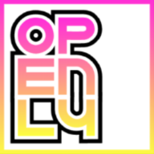

# Paul Standley


## OPEN



---

### Laravel __6__ setup

#### **Bash Setup**

```BASH

composer create-project --prefer-dist laravel/laravel open

composer require laravel/ui --dev

php artisan ui react

php artisan ui react --auth

npm install && npm run dev

npm run watch

```

### Conrtrollers Models Migrations

#### **Bash Controllers**

```BASH

php artisan make:controller ProfileController -r -m

```
